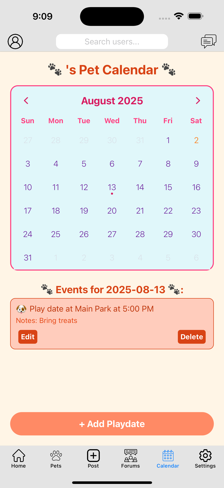
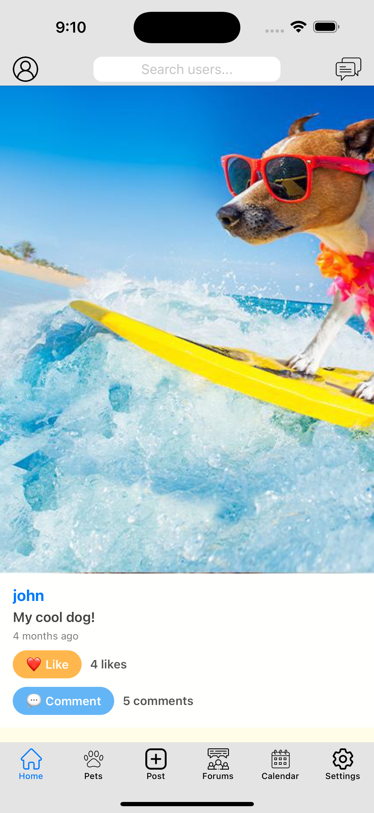
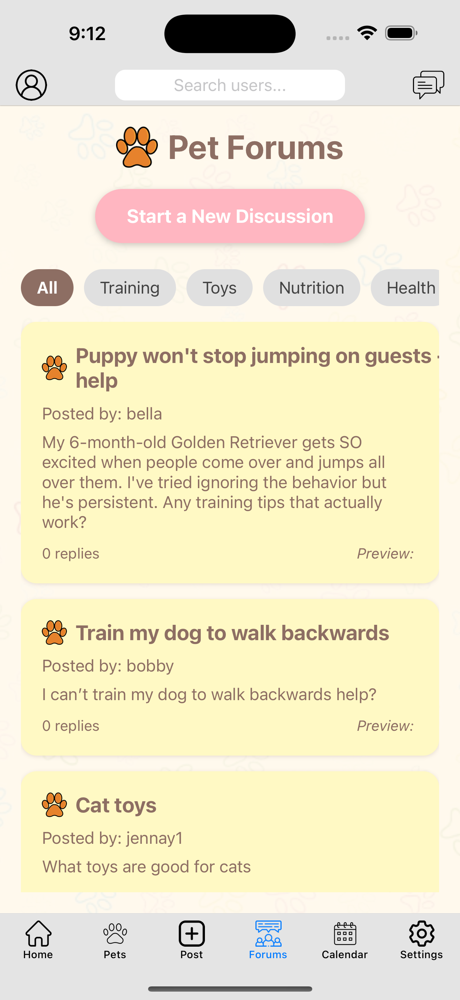

# PlayPals 🐾

**A comprehensive pet-themed social media and utility application for pet owners and enthusiasts**


## 🚀 Project Overview

PlayPals is a feature-rich mobile application that bridges the gap between social networking and pet care by providing a centralized platform where pet owners can connect, share experiences, schedule events, and build community around their beloved pets. This full-stack application demonstrates modern development practices with a focus on user experience and real-time functionality.

## 📱 Experience PlayPals

**Primary Platform**: React Native mobile application

### Running the Mobile App (Recommended)

**Prerequisites:**

- Node.js (v16+)
- Expo Go app on your phone ([iOS](https://apps.apple.com/app/expo-go/id982107779) | [Android](https://play.google.com/store/apps/details?id=host.exp.exponent))

**Setup:**

```bash
git clone https://github.com/jen444x/PlayPals.git
cd PlayPals/frontend
npm install
npx expo start
# Scan QR code with Expo Go app
```

_Note: The app will connect to the live PlayPals API at playpals-app.com for full functionality._

### Quick Web Preview

**Demo**: [https://playpals-app.com/](https://playpals-app.com/)

_For a quick look at PlayPals' core functionality. Full experience optimized for mobile._

## ✨ Key Features

### 🔐 **Authentication & User Management**

- Secure user registration and login with JWT tokens
- Password hashing with bcrypt for enhanced security
- Persistent session management with AsyncStorage

### 👤 **Profile & Pet Management**

- Comprehensive user profiles with customizable avatars
- Multi-pet profile management with photo uploads
- Real-time profile updates and data synchronization

### 📱 **Social Media Feed**

- Instagram-style feed with image and video support
- Like and comment functionality with real-time counters
- Infinite scrolling and pull-to-refresh capabilities
- Smart algorithm showing followed users first, then popular content

### 💬 **Real-time Messaging**

- Instant messaging using Socket.IO for real-time communication
- Media sharing capabilities (images and videos)
- Message history persistence and chat management

### 🗓️ **Event Calendar**

- Interactive calendar for scheduling pet-related events
- Color-coded event types (vet appointments, grooming, playdates)
- Event sharing to external calendars via ICS files
- Time picker integration for precise scheduling

### 💭 **Community Forums**

- Topic-based discussion threads for pet care advice
- Threaded conversations with reply functionality
- User-generated content moderation and management

## 🛠️ Technical Architecture

### **Frontend (React Native)**

- **Framework**: React Native with Expo for cross-platform development
- **Navigation**: React Navigation with tab and stack navigators
- **State Management**: React Hooks (useState, useEffect, useContext)
- **Form Handling**: Formik with Yup validation
- **Theming**: Dark/Light mode support with Context API
- **Media**: Expo ImagePicker and AV for media handling

### **Backend (Node.js)**

- **Framework**: Express.js with RESTful API design
- **Database**: PostgreSQL with connection pooling
- **Authentication**: JWT tokens with middleware protection
- **File Upload**: Multer for handling image/video uploads
- **Real-time**: Socket.IO for instant messaging
- **Security**: bcrypt password hashing, CORS configuration

### **Infrastructure**

- **Hosting**: DigitalOcean droplet with Ubuntu
- **Web Server**: Apache with reverse proxy configuration
- **SSL**: Certbot with Cloudflare DNS management
- **Process Management**: PM2 for production deployment
- **Database**: Self-hosted PostgreSQL instance

## 🏗️ System Design

```
┌─────────────────┐    ┌──────────────────┐    ┌─────────────────┐
│   React Native  │◄──►│   Express API    │◄──►│   PostgreSQL    │
│   Mobile App    │    │   Server         │    │   Database      │
└─────────────────┘    └──────────────────┘    └─────────────────┘
         │                       │
         │               ┌──────────────────┐
         └──────────────►│   Socket.IO      │
                         │   Real-time      │
                         └──────────────────┘
```

## 📊 Database Schema Highlights

- **Relational Design**: Normalized tables with proper foreign key relationships
- **User-Centric**: All data linked to user IDs for security and organization
- **Scalable**: Designed for growth with efficient indexing
- **Flexible**: Separate tables for different post types and interactions

## 🔧 Deployment & Setup

**Live Application**: [https://playpals-app.com/](https://playpals-app.com/)

Deployed on DigitalOcean droplet using:

- Ubuntu server with SSH access
- PostgreSQL database
- PM2 process management
- Apache reverse proxy with SSL via Certbot

## 📈 Performance Optimizations

- **Database**: Optimized queries with proper indexing and joins
- **Frontend**: FlatList for efficient scrolling, image caching
- **Real-time**: Socket.IO rooms for targeted message delivery
- **File Storage**: Organized directory structure for uploaded media
- **Responsive Design**: Adaptive layouts for various screen sizes

## 🧪 Development Methodology

- **Agile Approach**: Flexible development with regular team meetings
- **Feature-based Division**: Team members specialized in specific components
- **Version Control**: Git workflow with feature branches
- **Testing**: User flow testing and feedback integration
- **Documentation**: Comprehensive code documentation and API endpoints

## 👥 Team Collaboration

**My Contributions:**

- Full-stack development across frontend and backend
- Database schema design and optimization
- API endpoint development and authentication
- UI/UX implementation and responsive design
- Real-time messaging system implementation

**Team Structure:**

- 5-person development team with specialized roles
- Backend infrastructure, frontend development, UI/UX design
- Regular code reviews and integration testing
- Collaborative problem-solving and feature planning

## 🎯 Key Technical Achievements

- **Zero-downtime Deployment**: PM2 process management for production stability
- **Secure Authentication**: Industry-standard JWT implementation
- **Real-time Features**: Socket.IO integration for instant messaging
- **Cross-platform Compatibility**: Single codebase for iOS and Android
- **Scalable Architecture**: Modular design supporting future feature additions

## 📱 Screenshots

### Calendar Integration



Interactive event scheduling with color-coded categories and event management.
Users can easily add playdates, vet appointments, and other pet-related events with
detailed notes and time tracking.

### Social Media Feed



Instagram-style feed showcasing user posts with high-quality media support. Features
include like/comment functionality, user profiles, and engaging pet content sharing.

### Community Forums



Topic-based discussion platform where pet owners can seek advice and share experiences.
Organized by categories like Training, Health, Nutrition, and Toys for easy
navigation and relevant discussions.

## 🔮 Future Enhancements

- **Location Services**: GPS-based playdate suggestions
- **Push Notifications**: Real-time alerts for messages and events
- **Advanced Search**: Filter users and content by location and preferences
- **Analytics Dashboard**: User engagement and app usage metrics

## 🎓 Learning Outcomes

This project demonstrated proficiency in:

- **Full-stack Development**: End-to-end application development
- **Database Design**: Relational database architecture and optimization
- **Real-time Systems**: WebSocket implementation and management
- **Team Collaboration**: Agile development in a multi-person team
- **DevOps**: Server deployment, SSL configuration, and process management
- **Mobile Development**: Cross-platform app development with React Native

## 📞 Contact

**Jennifer Miranda**

- 📧 Email: miranda.jennifer0407@gmail.com
- 💼 LinkedIn: www.linkedin.com/in/jennifer-miranda-892687239
- 🐙 GitHub: https://github.com/jen444x
